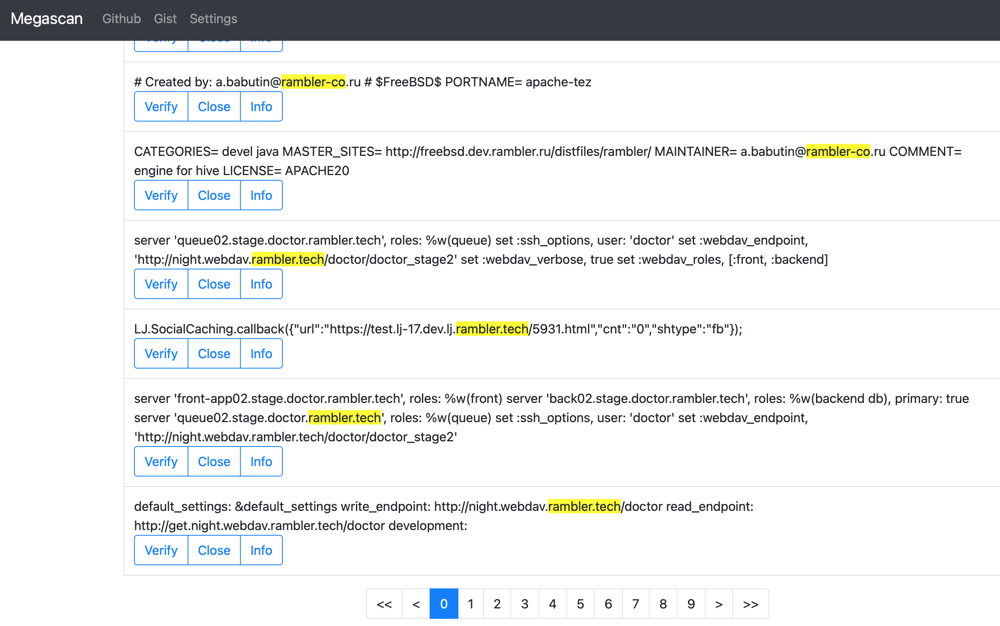
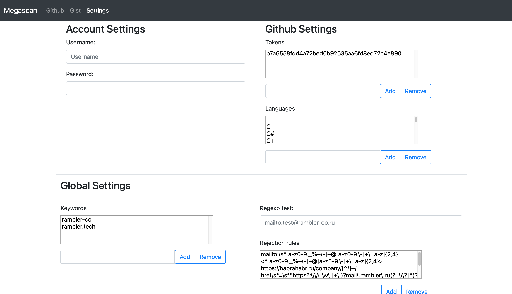

**Текущий функционал**

- Мониторинг github по ключевым словам
- Удаление дубликатов
- Фильтрация результатов поиска на основе регулярных выражений
- Возможность разметить утечки (false, verified)
- Просмотр подробной информации о репозиториии, авторе и т.п. 
- Подсветка синтаксиса

*TODO*
- Внутренний поиск по ключевым словам (по которым не ищем в github, но представляют интерес в утечках, типа password)
- Добавить поддержку Gist

